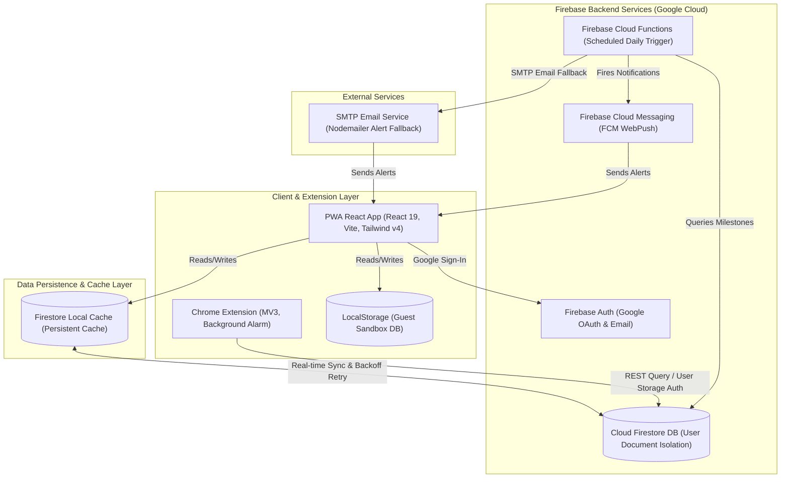

# About the Project: Exam Tracker Pro (v2)

Exam Tracker Pro is a modern, high-performance, portfolio-ready **Progressive Web App (PWA)** designed to help students and professionals manage upcoming competitive exam dates, application deadlines, admit card releases, and critical test events in one organized dashboard.

---

## 🏗️ Architecture & Technical Stack

The project is structured around an offline-first, client-driven PWA architecture supported by Firebase backend services:



### 1. Frontend & Presentation Layer
* **React + Vite**: Leverages Vite's blazing-fast bundler and hot module replacement for highly responsive development and highly optimized production builds.
* **Tailwind CSS (v4)**: Implements a clean, state-of-the-art interface utilizing glassmorphic panels, rich gradient fills, and animations. Dark mode states are managed dynamically via a class-based root toggle.
* **Lucide React Icons**: Consistent, modern, and lightweight vector iconography throughout the application.

### 2. State & Data Layer
* **TanStack React Query (v5)**: Manages all server state. It simplifies data fetching, implements cache expiration, and optimizes UI updates by avoiding redundant network requests.
* **React Hook Form + Zod**: Forms are bound to Zod validation schemas. This ensures inputs (like URLs, date comparisons, and status selections) are validated client-side with clean, dynamic warning labels before submission.
* **TypeScript (Strict Mode)**: Codebase is 100% typed for type-safety, ensuring robust data parsing and early bug detection.

### 3. Serverless Backend & Database
* **Firebase Authentication**: Implements secure Google OAuth sign-in and local credential tracking.
* **Cloud Firestore**: Stores exam and milestone data in real-time. Configured with **offline persistence** so the user can read, create, and edit entries offline, which automatically syncs with the cloud database once connection is restored.
* **Firestore Security Rules**: User data is strictly isolated. The backend rules verify that the authenticated `request.auth.uid` matches the document parent user path before permitting any read or write operation.

### 4. Background Services & Integrations
* **Chrome Extension**: MV3 background worker and popup providing immediate toolbar access to milestones within 7 days, syncing with Firestore via Google REST APIs.
* **Scheduled Functions & Email Fallback**: Scheduled Cloud Functions monitor upcoming dates daily and send push alerts, automatically falling back to Nodemailer SMTP email reminders if push tokens are unavailable.

---

## 💡 Key Technical Solutions & Challenges Solved

### 1. Secure PWA Service Worker Credentials Configuration
* **Problem**: PWAs require a service worker (`firebase-messaging-sw.js`) to handle background push notifications. However, hardcoding Firebase client keys inside the public service worker script risks leaking API credentials.
* **Solution**: We implemented **dynamic initialization**. When the PWA registers the service worker in `notificationService.ts`, it passes the configuration credentials as query parameters in the service worker URL (`/firebase-messaging-sw.js?apiKey=...`). The service worker reads these values at runtime using `self.location.search` and initializes Firebase dynamically.

### 2. Tailwind CSS v4 Class-Based Dark Mode Toggling
* **Problem**: Tailwind CSS v4 defaults to system media query checks (`prefers-color-scheme`) for compiling dark variants. Toggling a manual `.dark` class on the `<html>` element does not apply dark styles out-of-the-box.
* **Solution**: We defined a custom variant rule at the very top of `index.css`:
  ```css
  @import "tailwindcss";
  @custom-variant dark (&:where(.dark, .dark *));
  ```
  This instructs the compiler to listen for the `.dark` class on the root element, enabling seamless theme toggles stored persistently in `localStorage`.

### 3. Automated CI/CD Deployment with GitHub Actions
* **Problem**: Manual deployments using the Firebase CLI are prone to environmental drift. Additionally, Vite requires Node.js version `>= 20.19+` or `>= 22.12+`, while standard actions defaults often run older LTS versions like Node 18, leading to syntax/CustomEvent errors during Vite builds.
* **Solution**: We configured GitHub Action workflows under `.github/workflows/` that spin up Node 20 runners. It runs type checking, unit tests (Vitest), E2E browser tests (Playwright), and deploys with raw `firebase-tools`.

### 4. Sandbox Demo Mode for Instant Evaluation
* **Problem**: Forcing recruiters to authenticate with Google to evaluate the app creates onboarding friction.
* **Solution**: Implemented a local storage mock driver that intercepts Firestore calls when in guest mode, providing full read/write simulation completely client-side.

---

## 📁 Key File Structure

* `src/App.tsx` — Router definitions and page-level layouts.
* `src/index.css` — Design system configurations, Tailwind imports, and dark mode class triggers.
* `src/components/`
  * `Navbar.tsx` — Transparent glassmorphic header containing theme toggles and account menus.
  * `ExamCard.tsx` — Visual card displaying title, status countdown badges, and milestone progress.
  * `DashboardStats.tsx` — Analytical panels displaying metrics (Active Exams, Pending Deadlines, and Upcoming Tests).
  * `AnalyticsView.tsx` — Dynamic charts and sector loading breakdown calculations.
* `src/services/`
  * `firebase.ts` — Core Firebase configuration and Firestore offline settings.
  * `examService.ts` — Firestore abstraction containing query snapshot and cursor pagination logic.
  * `notificationService.ts` — Client permissions checker and dynamic background sw-registration.
  * `demoService.ts` — Sandboxed Guest access database mocks.
* `src/utils/`
  * `recurrence.ts` — Recurrence rule date rollover automation using `rrule`.
  * `calendarExport.ts` — Multi-event calendar `.ics` download compiler using `ical-generator`.
