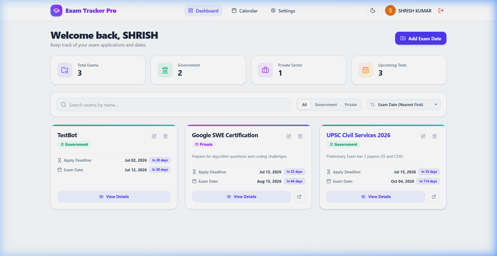
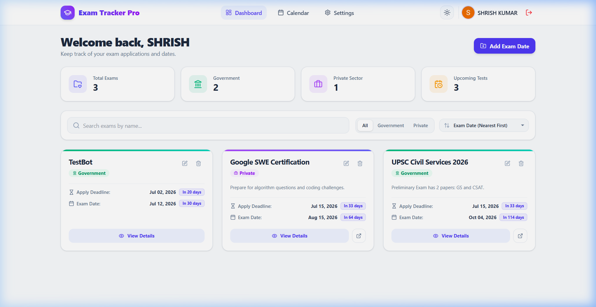
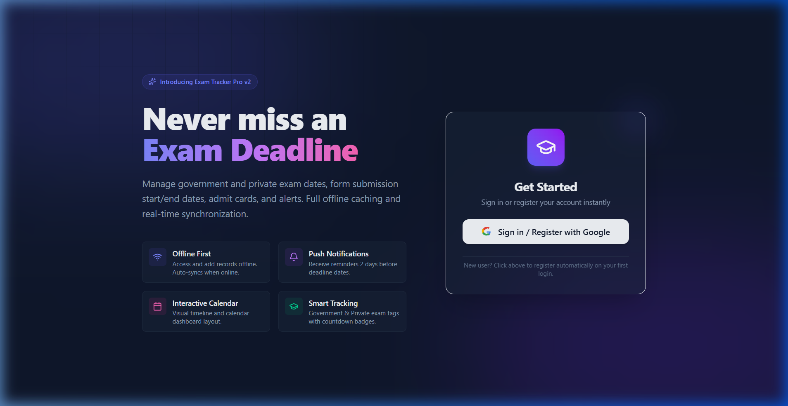
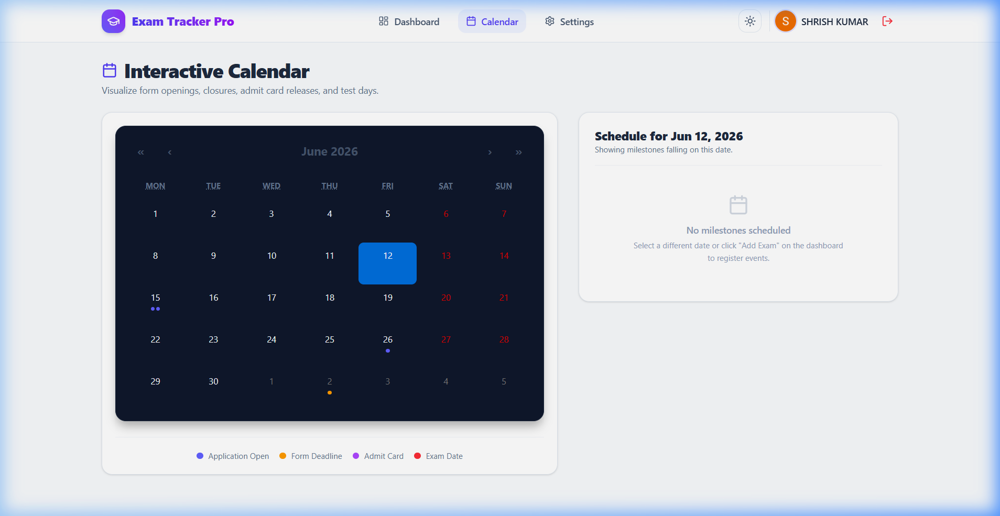
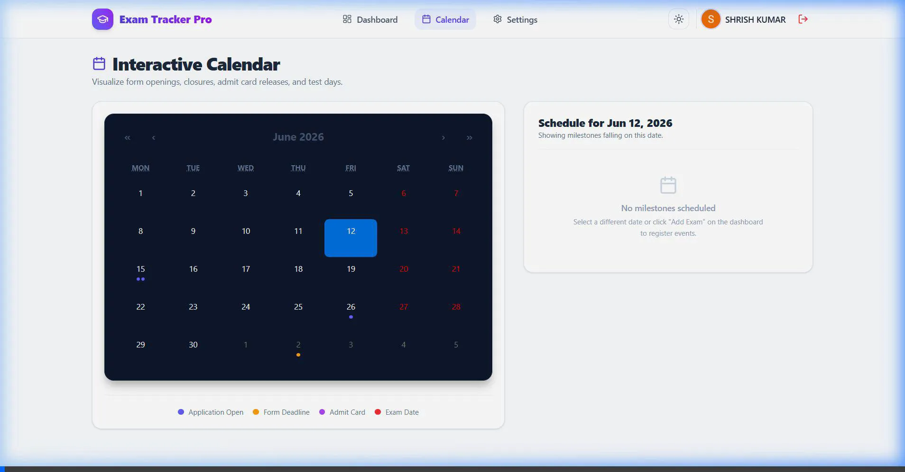
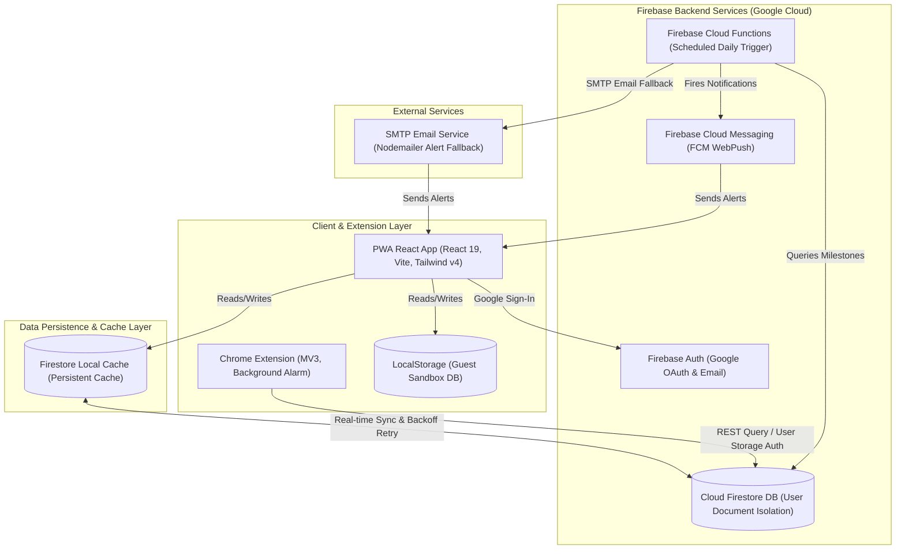

# Exam Tracker Pro (v2)

Exam Tracker Pro is a production-ready, portfolio-worthy Progressive Web App (PWA) built with React, Vite, and Tailwind CSS. Backed by Firebase, it provides a seamless user experience to track application forms, admit card releases, and exam dates.

## 📸 Visual Showcase & Interactive Demo

| ☀️ Desktop Light Mode | 🌙 Desktop Dark Mode |
| --- | --- |
|  |  |

| 🔑 Login Landing Page | 📅 PWA Calendar View |
| --- | --- |
|  |  |

### 🎥 Live App Interaction Demo


---

## 🚀 Key Features
- **Secure Authentication**: Google Sign-In and standard email/password authentication powered by Firebase Authentication.
- **Guest Sandbox / Live Demo Mode**: Explore the full application (including schedules, details, settings, and checklists) instantly in-browser without logging in, using offline-first local storage drivers.
- **Study Planning Checklist**: Track your preparation for each exam. Add revision topics, mock tests, and checklist tasks directly inside the exam details screen, complete with a visual progress bar and offline-first persistence.
- **Real-Time Data Sync**: Firestore real-time snapshots with offline-first local persistence (auto-syncs when reconnecting).
- **Interactive Calendar**: Event tags showing application deadlines, start dates, admit card releases, and test days.
- **Smart Countdown Badges**: Color-coded badges indicating upcoming milestones, tomorrow, today, or expired states.
- **Automated Push Notifications**: Background service worker integrated with FCM. A scheduled daily Cloud Function alerts users 2 days before any scheduled milestone.
- **JSON Export & Restore**: Allows manual backup of data to local files and immediate parsing/restoration.
- **Polished UX**: Class-based Dark Mode, responsive layouts (mobile bottom tab-bar), and beautiful loading skeletons.

---

## 🛠️ Tech Stack
- **Frontend**: React, Vite, Tailwind CSS, Lucide Icons, Date-fns, React Calendar, React Router DOM
- **Validation**: React Hook Form, Zod schema resolver
- **State Management**: TanStack React Query (server-state & query cache)
- **Backend & Serverless**: Firebase Auth, Firestore, Cloud Messaging, Hosting, and Cloud Functions (Node.js 22, V2 Scheduled triggers)

---

## 🏗️ System Architecture

The following diagram details the flow of data, state syncing, and notification scheduling across the Client Layer, Persistence/Offline-Cache Layer, Firebase Cloud Serverless services, and SMTP Fallbacks:



---

## ⚡ One-Click Deployment

Deploy the frontend React application instantly to Vercel or Render with one click:

[](https://vercel.com/new/clone?repository-url=https%3A%2F%2Fgithub.com%2FAndDevil%2FExam-Tracker-Full)
&nbsp;&nbsp;&nbsp;&nbsp;
[](https://render.com/deploy?repo=https://github.com/AndDevil/Exam-Tracker-Full)

> [!NOTE]
> When deploying to Vercel or Render, make sure to add your Firebase configuration details as environment variables matching those in `.env.example` so the PWA connects to your database!

---

## ⚙️ Setup Instructions

### 1. Firebase Project Configuration
1. Go to the [Firebase Console](https://console.firebase.google.com/) and click **Add project** to create a project named `exam-tracker-pro`.
2. **Enable Authentication**:
   - Navigate to **Build > Authentication** and click **Get Started**.
   - Under **Sign-in method**, choose **Google**, enable it, select a support email, and save.
3. **Enable Firestore Database**:
   - Go to **Build > Firestore Database** and click **Create database**.
   - Start in **Test Mode** (or select default locations).
4. **Register Web App**:
   - Go to **Project Settings** (gear icon) > **General**.
   - Click the **Web (</>)** icon, register your app, and copy the `firebaseConfig` credentials.
5. **Get VAPID Key for Notifications**:
   - Go to **Project Settings > Cloud Messaging**.
   - Under **Web configuration**, look for **Web Push certificates** and click **Generate key pair**.
   - Copy this key; it will be your `VITE_FIREBASE_VAPID_KEY`.

---

### 2. Local Setup & Environment

> [!IMPORTANT]
> **Node.js Requirement**: This project uses Vite, which requires **Node.js version 20.19+ or 22.12+**. Please verify your active version (`node -v`) before proceeding.

1. Clone the repository and navigate to the project root:
   ```bash
   cd "Exam Tracker Full"
   ```
2. Install the node packages:
   ```bash
   npm install --legacy-peer-deps
   ```
3. Create a `.env` file in the root directory by copying the `.env.example` template:
   ```bash
   copy .env.example .env
   ```
4. Open the `.env` file and populate it with your Firebase client configuration details:
   ```env
   VITE_FIREBASE_API_KEY=AIzaSy...
   VITE_FIREBASE_AUTH_DOMAIN=exam-tracker-pro.firebaseapp.com
   VITE_FIREBASE_PROJECT_ID=exam-tracker-pro
   VITE_FIREBASE_STORAGE_BUCKET=exam-tracker-pro.appspot.com
   VITE_FIREBASE_MESSAGING_SENDER_ID=1234567890
   VITE_FIREBASE_APP_ID=1:12345:web:abcd
   VITE_FIREBASE_MEASUREMENT_ID=G-ABCDE
   VITE_FIREBASE_VAPID_KEY=BM_long_vapid_public_key_string...
   ```

---

### 3. Running Locally
To launch the developer web server locally:
```bash
npm run dev
```
Open [http://localhost:5173](http://localhost:5173) in your browser.

---

### 4. Setting up Firebase Cloud Functions
The scheduled Cloud Function sends automated notifications 2 days prior to any exam dates.

1. Make sure you have the Firebase CLI tools installed globally:
   ```bash
   npm install -g firebase-tools
   ```
2. Log in to your Firebase account via CLI:
   ```bash
   firebase login
   ```
3. Use the CLI to bind your local repository to your Firebase project:
   ```bash
   firebase use --add
   ```
   Select your created Firebase project from the list.
4. Navigate into the `functions` folder and install its dependencies:
   ```bash
   cd functions
   npm install
   cd ..
   ```
5. Deploy Cloud Functions and Security Rules to Firebase:
   ```bash
   firebase deploy --only functions,firestore:rules
   ```

---

### 5. Production Build & Hosting Deployment
To build the static PWA assets and deploy the frontend to Firebase Hosting:
1. Compile the build bundles:
   ```bash
   npm run build
   ```
2. Deploy the web assets to Firebase Hosting:
   ```bash
   firebase deploy --only hosting
   ```

---

### 6. Running Tests
To run unit and end-to-end tests:
1. **Unit & Integration Tests (Vitest)**:
   ```bash
   npm run test
   ```
2. **End-to-End Tests (Playwright)**:
   Make sure you have installed the necessary browser binaries first:
   ```bash
   npx playwright install chromium
   ```
   Ensure the local dev server is running on port 5173, then execute:
   ```bash
   npm run test:e2e
   ```
3. **TypeScript Diagnostics**:
   ```bash
   npm run typecheck
   ```

---

### 7. Installing the Chrome Extension
The project includes a Google Chrome extension under `/extension` that pulls upcoming milestones from your dashboard.
1. Open Google Chrome and navigate to `chrome://extensions/`.
2. Toggle the **Developer mode** switch in the top right.
3. Click **Load unpacked** in the top left.
4. Select the `/extension` directory in this project folder.
5. Click the extension icon in your browser toolbar, log in with your account credentials, and view your next 7 days of milestones instantly.

---

### 8. Cloud Functions Email SMTP Configuration
To enable email alerts if device push notifications fail, configure SMTP credentials for Nodemailer in your Cloud Functions run environment:
- Set environment variables `SMTP_HOST`, `SMTP_PORT`, `SMTP_USER`, `SMTP_PASS`, and `SMTP_FROM`.
- If SMTP variables are missing, the scheduled function will execute in **Simulation Mode** and output email alerts directly to the console log.

---

### 9. Automated CI/CD (GitHub Actions)
We have configured GitHub Action workflows under `.github/workflows/` to automatically verify, test, build, and deploy your application to Firebase Hosting.

The pipeline is set up to run on **Node.js 20** runners. It runs TypeScript checks, runs unit tests, runs E2E tests, and deploys directly using the raw Firebase CLI tools (`npx firebase-tools`) for maximum deployment reliability.

To enable the automation pipeline:
1. **Generate a Service Account Key**:
   - Go to your Google Cloud Console / Firebase Console.
   - Create a service account with the **Firebase Hosting Admin** role.
   - Generate and download a **JSON Service Account Key**.
2. **Add Secret to GitHub**:
   - Go to your GitHub repository > **Settings** > **Secrets and variables** > **Actions**.
   - Click **New repository secret**.
   - Name the secret **`FIREBASE_SERVICE_ACCOUNT_EXAM_TRACKER_PRO_87B3D`**.
   - Paste the complete contents of the downloaded JSON key file as the value.
3. **Commit & Push Workflows**:
   - Ensure the workflows located in `.github/workflows/` are committed and pushed to your GitHub repository.
   
Once added, any push to the `master` branch will trigger a production deployment, and any Pull Request will automatically deploy a preview channel URL!

---

## 🔒 Firestore Security Rules
The database operates under user-isolation policies declared in `firestore.rules`. Users can only perform CRUD operations on their own documents:
```javascript
match /users/{userId} {
  allow read, write: if request.auth != null && request.auth.uid == userId;
  
  match /exams/{examId} {
    allow read, write: if request.auth != null && request.auth.uid == userId;
  }
}
```

---

## 📲 PWA Installation & Offline Support

Exam Tracker Pro is a fully compliant Progressive Web App (PWA). Follow these instructions to install the application and configure offline tracking:

### Installation Guides
- **Google Chrome / Microsoft Edge (Desktop)**:
  Look for the **install icon** (computer monitor with a downward arrow) in the right side of the address bar, or click **"Install App"** inside the top floating banner on the Dashboard.
- **Safari (iOS / iPadOS)**:
  Open the app in Safari, tap the **Share** button (box with upward arrow) at the bottom, scroll down, and tap **"Add to Home Screen"**.
- **Google Chrome (Android)**:
  Tap the **"Install App"** banner at the top, or tap the three dots in Chrome's top right corner and select **"Add to Home screen"**.

### PWA Capabilities
1. **Stand-alone Application Mode**: When launched from the home screen, the app runs in its own window without browser controls, adopting a native layout.
2. **Offline-First Resilience**: All core code, layout files, styles, fonts, and assets are cached locally via the workbox service worker (`sw.js`).
3. **Optimistic Database Queue**: Any adds, updates, or deletes made offline are immediately reflected locally in the UI, queued in persistent storage, and synchronized to Firestore the moment internet connectivity returns.

---

## 📖 Deep-Dive Documentation
For detailed information on the project architecture, design choices, file structure, and technical solutions (like secure PWA credential handling, Tailwind v4 class-based dark mode, and pipeline fixes), check out [ABOUT_THE_PROJECT.md](file:///c:/Users/Shrish/Downloads/Intern%20projects/Exam%20Tracker%20Full/ABOUT_THE_PROJECT.md) in the project root.

